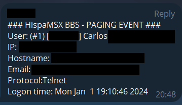

# Synchronet BBS external sysop pager
This project is a fork of [echiken's Synchyronet BBS chat_pager](https://gitlab.synchro.net/main/sbbs/-/tree/master/xtrn/chat_pager) that adds the following features to a [Syncrhonet BBS](http://synchro.net):

1. Support for paging using a remote PC Speaker connected to the Raspberry Pi GPIO and served over HTTP. This can be implented via the project at https://github.com/cmilanf/rpi-netplaytone. This effectively enables to bring back classic PC Speaker paging even if you are running Synchronet BBS from a virtual machine or a PC Speaker-less system.
2. Support for paging via Telegram bot.

These channels add to the previously existing ones: IRC and email.

## Setup
1. Install all the files from this repo in any directory accesible by Synchronet BBS.
  For example: `/sbbs/xtrn/sysop_pager`
2. Run `scfg`
3. Select `Chat Features`
4. Select `External Sysop Chat Pagers`
5. Hit enter on the blank line at the bottom to create a new record
6. Set the `Command Line` to: `?/sbbs/xtrn/sysop_pager/page_sysop.js`

Notice Synchronet BBS will only use **one** external pager from the list in `External Sysop Chat Pagers`. Synchronet will take the list of external pagers as priority order, trying each one. When paging is sucessful with one, it won't use the following ones. For making your pager work, make sure to put the first in the pagers list or render the other ones inaccesible via Access Requirements.

## Configuration
1. Browse to the `xtrn/sysop_pager/` directory
2. Copy `example-settings.ini`  to a new file, name it `settings.ini` 
3. Edit `settings.ini`

### Telegram setup
You can get paging notifications via [Telegram Bot API](https://core.telegram.org/bots/api). How to create a Telegram Bot is out of the scope of this documentation, but it well explained [here](https://core.telegram.org/bots/tutorial).

In `[telegram]` section of `settings.ini`:
1. Fill `chat_id` and `token` from your Telegram Bot and channel.
2. Do NOT replace the `{TOKEN}` keyword in `api_url`.
3. Set `enabled` to `true`.

Sample of Telegram paging:



You may get the following error message in you Synchronet BBS after enabling Telegram:
```
term TLS WARNING 'Server provided a broken/invalid certificate, try again with a reduced level of certificate compliance checking' (-32) setting attribute 6001
```
_My guess_ is that this could be happening because Synchronet BBS TLS stack, provided by [cryptlib](https://cryptlib.com/), is not trusting the certificate chain used by `api.telegram.org`. If this is your case, there is a somewhat dirty workarround that implies proxying Telegram Bot API calls.

#### Telegram setup: broken/invalid certificate workarround
Remember this is a workarround, if you decide to implement it, it is **at your own risk**.

1. Make sure there is no other software in the Synchronet BBS server/virtual machine/container calls `api.telegram.org`.
2. Edit `/etc/hosts` and add `api.telegram.org` to the `127.0.0.1` entry. For example: `127.0.0.1 locahost api.telegram.org`.
3. Install a reverse proxy software, as example I will use [nginx](https://nginx.org/).
4. Add to `/etc/nginx/sites-available/default` a configuration similar to this one:
```
server {
        listen 127.0.0.1:8080;
        server_name api.telegram.org;

        location / {
                resolver your_dns_resolver;
                set $telegram_api https://api.telegram.org;

                proxy_pass $telegram_api$request_uri;
        }
}
```
5. Feel free to change the listening port.
6. Set a DNS `resolver`, such as Google's `8.8.8.8` or Cloudflare's `1.1.1.1`.
7. Go back to `settings.ini` and in `[telegram]` change the `api_url` from `https` to `http`, do not forget to change the port if needed. Remember as well you shouldn't be modifying the `{TOKEN}` keyword.

Hopefully, this workarround won't be needed in the future.

### Remote Raspberry Pi PC Speaker setup
Do you want paging via PC Speaker but you are running Synchronet BBS from a virtual machine, or a PC Speaker-less machine? You can use this method to implement it.

1. Setup a PC Speaker enabled hardware that is able to play tones via HTTP interface. I implemented it with a Raspberry Pi, a PC Speaker connected to GPIO and the software in the repo [rpi-netplaytone](https://github.com/cmilanf/rpi-netplaytone).
2. In `settings.ini`, `[pcspeaker]` section, fill `api_url`, `tone` and set `enabled` to `true`.

Sample of Raspberry Pi paging:

[](https://www.youtube.com/watch?v=6jjUNOervsY)

### IRC Bot setup
1. In the `[terminal]` section of `settings.ini`, edit `irc_server`, `irc_port`, and `irc_channel` as needed
2. Browse to the `xtrn/sysop_pager/ircbot/` directory
3. Open `for-ircbot.ini` with a text editor
4. Copy its contents to your clipboard
5. Browse to your `ctrl/` directory
6. Open `ircbot.ini` with a text editor
7. Paste the previously copied file contents into the bottom of this file

## Finishing Up
1. Synchronet will need to recycle the terminal server thread to pick up changes
2. It may be necessary to restart your BBS
3. You will need to issue the `restart` command to your IRC bot

## Using
Users who page the sysop will be shown a progress/time bar while they wait for you to respond.

You will receive notifications via the configured methods. If using IRC bot, it will notify you in the channel you've configured that somebody is paging you. Respond with the command `!chat n`, where `n` is the node number, to pull the user into IRC chat.

## Notes
This addon has NOT been extensively tested by echiken or me. USE AT YOUR OWN RISK.

If you run your IRC bot via `jsexec`, the `IRC Pull` feature will not work. It will work if you run your IRC bot as a service.

You don't have to use the `IRC Pull` feature; you can always go to your host system and break into chat with the built in tools (from sbbsctrl or umonitor).
